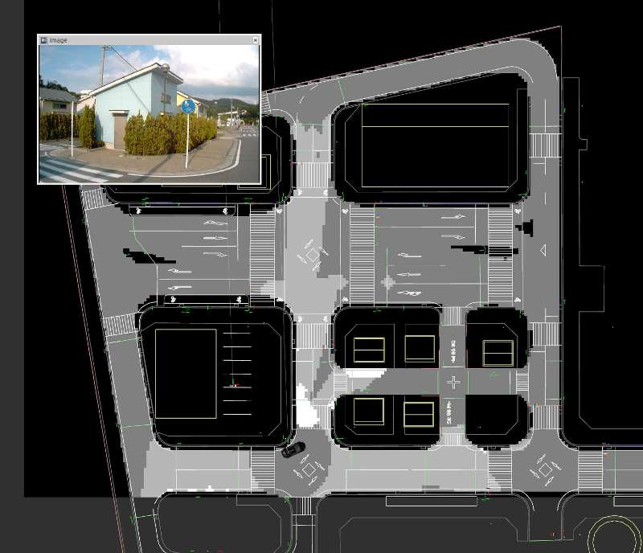

# Road Occupancy Processor

This package generates the occupancy grid indicating the status of the road. It uses the point cloud from a filtered sensor and the ADAS Map data.

The occupancy grid can be conceptualized as a one dimensional 8-bit depth bitmap.(占用网格可以概念化为一维 8 位深度位图)

This package publishes a GridMap/OccupancyGrid with four different possible values:
- UNKNOWN
- FREE
- NO ROAD
- OCCUPIED

These values can be set using parameters, as described in the *Configuration Parameters* section below.

### Extra requirements for compilation
- GridMap (http://wiki.ros.org/grid_map)

### Prerequisites
- Localization working (TF between velodyne and world)
  - PCD Map (map)
  - TF for the Map (tf map->world)
  - NDT matching (tf world-> base_link)
  - Base link to Localizer (tf base_link -> velodyne)
- Ground filtering method publishing `/points_ground` and `/points_no_ground`. Autoware has three available:
  - `ray_ground_filter`
  - `ring_ground_filter`
  - `euclidean_cluster` with Planar Ground removal

- `wayarea2gridmap` node from Semantics in the Computing Tab
  - Vector Map in `/vector_map` (also known as ADAS Map)
    - VectorMap must contain the definition of road areas (way_areas)

### Data subscription
This node subscribes to:
- Ground filtered in `/points_ground` (sensor_msgs::PointCloud)
- Obstacle points in `/points_no_ground` (sensor_msgs::PointCloud)
- GridMap containing the road processed in `/grid_map_wayarea` (grid_map::GridMap)

### Data publishing
- `gridmap_road_status` publishes the native format of the grid_map package. This can be used to extend the functionalities of this package.
- `occupancy_road_status` publishes the native ros `nav_msgs::OccupancyGrid` message.

### How to run
From a sourced terminal in the workspace:
`roslaunch road_occupancy_processor road_occupancy_processor.launch`

### Quick Setup
**This is only a quick guide, each node must be properly configured**

1. Load PointCloud Map (Map tab)
1. Load VectorMap with wayareas available (Map tab)
1. Load TF between map and world frames (Map tab)
1. Load TF between base_link and Localizer (Setup tab)
1. Launch voxel_grid_filter (Sensing tab/Points Downsampler)
1. Launch ray_ground_filter (Sensing tab/Points Preprocessor)
1. Launch ndt_matching (Computing tab/Localization)
1. Initialize NDT pose
1. Launch wayarea2grid (Computing tab/Localization)
1. Launch road_occupancy_processor (Computing tab/Localization)

### Configuration parameters
* `points_ground_src` (default=`"points_ground"`) defines the PointCloud source topic containing only the ground points.
* `points_no_ground_src` (default=`"points_no_ground"`) defines the PointCloud source topic containing only the obstacle points.
* `wayarea_topic_src` (default=`grid_map_wayarea`) defines the name of the topic containing the grid_map_msgs:GridMap containing the road areas.
* `wayarea_layer_name` (default=`"wayarea"`) defines the name of the layer in the topic `wayarea_topic_src` that contains the road areas.
* `output_layer_name` (default=`road_status`) defines name of the output layer in the published GridMap object. If running several instances, each vehicle one can publish a different layer and later add them.
* `road_unknown_value` (default=`"128"`) indicates the value to fill in the occupancy grid when a cell is **UNKNOWN**.
* `road_free_value` (default=`"75"`) indicates the value to fill in the occupancy grid when a cell is **FREE**. Should be a number between 0-255.
* `road_occupied_value` (default=`"0"`) indicates the value to fill in the occupancy grid when a cell is **OCCUPIED**. Should be a number between 0-255.
* `no_road_value` (default=`"255"`) indicates the value to fill in the occupancy grid when a cell is **NO ROAD**. Should be a number between 0-255.

### Coordinate Frame
The occupancy grid is published in the same coordinate frame as the input GridMap from `/grid_map_wayarea`.

### Color representation using default values

**Black** color represents areas not defined as NO ROAD in the vector map.

**Dark gray** indicates UNKNOWN areas as detected by this node.

**Light gray** means the area is FREE.

**White** is used for OCCUPIED areas.

